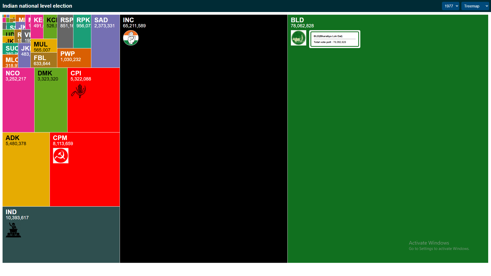
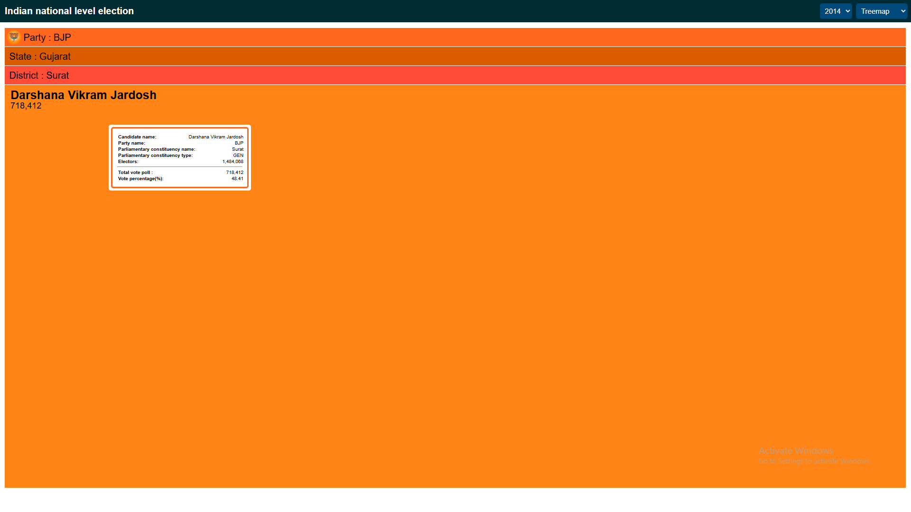
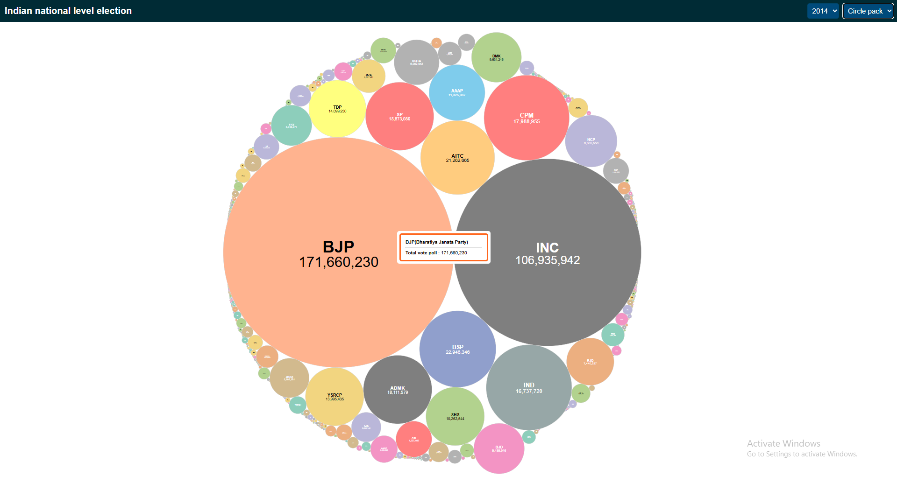
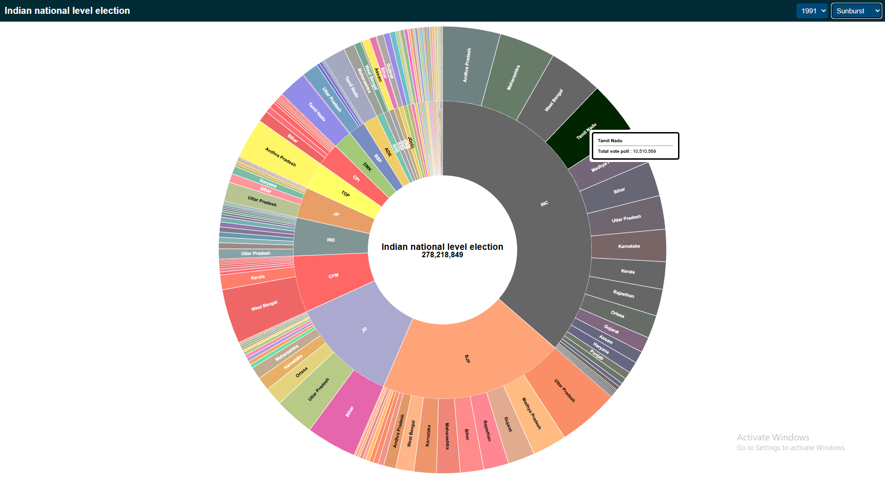
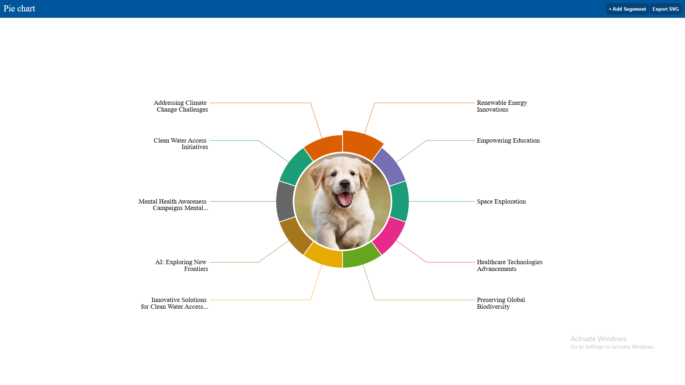
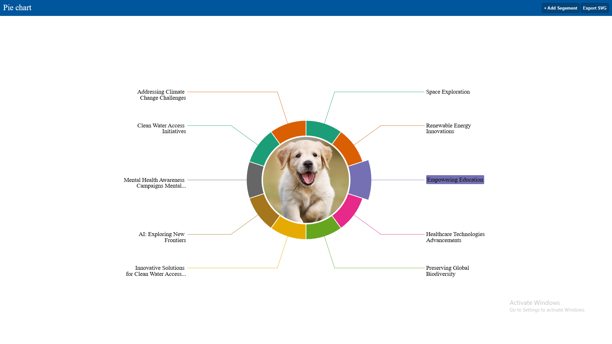

# D3.js Projects Showcase

*A collection of interactive and dynamic charts built with D3.js.*

---

## Project Description

This repository showcases various data visualization projects using **D3.js**, demonstrating different types of charts and interactive visualizations. Each chart is organized in a separate folder with its own assets and source files.

All chart preview images are stored centrally in the `assets/` folder.

---

## Project Structure

<table style="width: 100%; border-collapse: collapse;">
  <thead>
    <tr>
      <th style="padding: 12px; text-align: center; border-bottom: 1px solid #ddd; background-color: #f4f4f4;">Chart</th>
      <th style="padding: 12px; text-align: center; border-bottom: 1px solid #ddd; background-color: #f4f4f4;">Preview</th>
      <th style="padding: 12px; text-align: center; border-bottom: 1px solid #ddd; background-color: #f4f4f4;">Link</th>
    </tr>
  </thead>
  <tbody>
    <tr>
      <td style="padding: 12px; text-align: center; border-bottom: 1px solid #ddd;">Pack Layout Chart</td>
      <td style="padding: 12px; text-align: center; border-bottom: 1px solid #ddd;">
         
        

          
          
          
        

      </td>
      <td style="padding: 12px; text-align: center; border-bottom: 1px solid #ddd;"><a href="./charts/pack_layout_001/" style="text-decoration: none; color: #007bff;">Go to Folder</a></td>
    </tr>
    <tr>
      <td style="padding: 12px; text-align: center; border-bottom: 1px solid #ddd;">Pie Chart</td>
      <td style="padding: 12px; text-align: center; border-bottom: 1px solid #ddd;">
         
        

          
        

      </td>
      <td style="padding: 12px; text-align: center; border-bottom: 1px solid #ddd;"><a href="./charts/pie_chart_002/" style="text-decoration: none; color: #007bff;">Go to Folder</a></td>
    </tr>
        <tr>
      <td style="padding: 12px; text-align: center; border-bottom: 1px solid #ddd;">Wind Chart</td>
      <td style="padding: 12px; text-align: center; border-bottom: 1px solid #ddd;">
         
      </td>
      <td style="padding: 12px; text-align: center; border-bottom: 1px solid #ddd;"><a href="./charts/wind_chart_003/" style="text-decoration: none; color: #007bff;">Go to Folder</a></td>
    </tr>

  </tbody>
</table>
> **Note:** Place all your chart preview images in the `assets/` directory and name them properly (e.g., `bar-chart.png`, `line-chart.png`).

---

## Used Technologies

* **D3.js v7**
* **HTML5**
* **CSS3**
* **Vanilla JavaScript**

---
