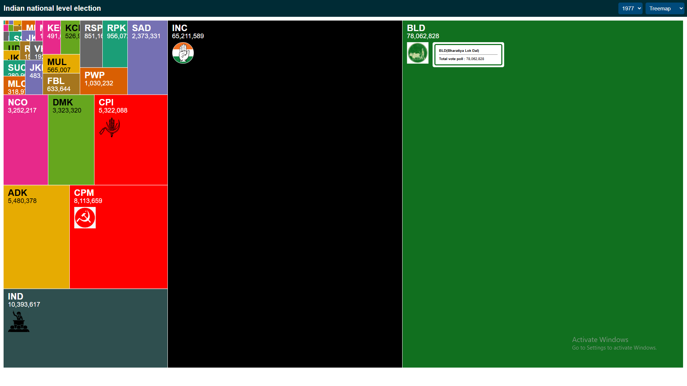

# D3.js Projects Showcase

*A collection of interactive and dynamic charts built with D3.js.*

---

## Project Description

This repository showcases various data visualization projects using **D3.js**, demonstrating different types of charts and interactive visualizations. Each chart is organized in a separate folder with its own assets and source files.

All chart preview images are stored centrally in the `assets/` folder.

---

## Project Structure

| Chart            | Preview                                    | Link                            |
| :--------------- | :----------------------------------------- | :------------------------------ |
| **PackLayout Chart**    |        | [Go to Folder](./bar-chart/)    |
| **Line Chart**   |      | [Go to Folder](./line-chart/)   |
| **Pie Chart**    |        | [Go to Folder](./pie-chart/)    |
| **Scatter Plot** |  | [Go to Folder](./scatter-plot/) |
| **Bubble Chart** |  | [Go to Folder](./bubble-chart/) |
| **Area Chart**   |      | [Go to Folder](./area-chart/)   |

> **Note:** Place all your chart preview images in the `assets/` directory and name them properly (e.g., `bar-chart.png`, `line-chart.png`).

---

## Steps to Run a Chart Locally

Each chart project is a standalone HTML + D3.js file.
Follow these steps to run any chart:

1. Clone the repository:

   ```bash
   git clone https://github.com/your-username/D3js-projects.git
   cd d3js-projects-showcase
   ```

2. Navigate to the specific chart folder, for example:

   ```bash
   cd bar-chart
   ```

3. Open the `index.html` file in your browser:

   * You can simply double-click the `index.html`, **or**
   * Run a simple local server to avoid CORS issues:

     ```bash
     npx serve .
     ```

     or

     ```bash
     python3 -m http.server
     ```

4. View the chart live in your browser at:

   ```
   http://localhost:5000
   ```

---

## Used Technologies

* **D3.js v7**
* **HTML5**
* **CSS3**
* **Vanilla JavaScript**

---
