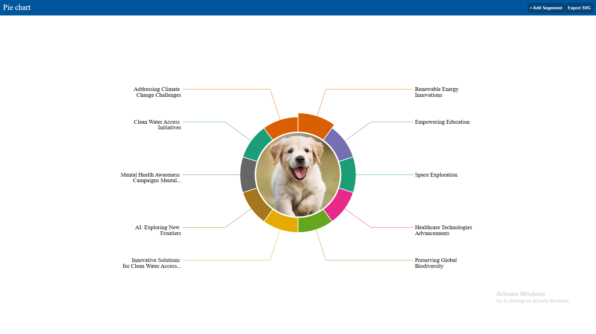

# D3.js Projects Showcase

*A collection of interactive and dynamic charts built with D3.js.*

---

## Project Description

This repository showcases various data visualization projects using **D3.js**, demonstrating different types of charts and interactive visualizations. Each chart is organized in a separate folder with its own assets and source files.

All chart preview images are stored centrally in the `assets/` folder.

---

## Project Structure

| Chart            | Preview                                    | Link                            |
| :--------------- | :----------------------------------------- | :------------------------------ |
| **PackLayout Chart**    |   

         | [Go to Folder](./charts/pack_layout_001/)    |
| **Pie Chart**    |        | [Go to Folder](./charts/pie_chart_002/)    |

> **Note:** Place all your chart preview images in the `assets/` directory and name them properly (e.g., `bar-chart.png`, `line-chart.png`).

---

## Used Technologies

* **D3.js v7**
* **HTML5**
* **CSS3**
* **Vanilla JavaScript**

---
